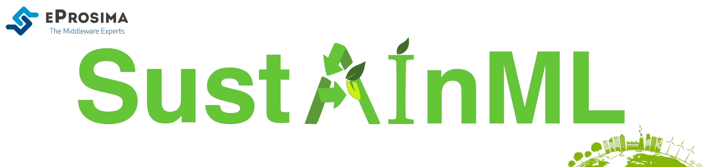

[](https://sustainml.eu/)

<br>

<div class="menu" align="center">
    <strong>
        <a href="https://eprosima.com/index.php/downloads-all">Download</a>
        <span>&nbsp;&nbsp;•&nbsp;&nbsp;</span>
        <a href="https://sustainml.readthedocs.io/en/latest">Docs</a>
        <span>&nbsp;&nbsp;•&nbsp;&nbsp;</span>
        <a href="https://sustainml.eu/index.php/news">News</a>
        <span>&nbsp;&nbsp;•&nbsp;&nbsp;</span>
        <a href="https://twitter.com/EProsima">Twitter</a>
        <span>&nbsp;&nbsp;•&nbsp;&nbsp;</span>
        <a href="mailto:info@eprosima.com">Contact Us</a>
    </strong>
</div>

<br><br>

<div class="badges" align="center">
    <a href="https://opensource.org/licenses/Apache-2.0"></a>
    <a href="https://github.com/eProsima/SustainML/releases"></a>
    <a href="https://github.com/eProsima/SustainML/issues"></a>
    <a href="https://github.com/eProsima/SustainML/network/memberss"></a>
    <a href="https://github.com/eProsima/SustainML/stargazerss"></a>
    <a href="https://SustainML.readthedocs.io/en/latest/"></a>
</div>

<br><br>

*SustainML* is a framework and an associated toolkit that will foster energy efficiency throughout the whole life-cycle of ML applications: from the design and exploration phase that includes exploratory iterations of training, testing and optimizing different system versions through the final training of the production systems (which often involves huge amounts of data, computation and epochs) and (where appropriate) continuous online re-training during deployment for the inference process.
The framework will optimize the ML solutions based on the application tasks, across levels from hardware to model architecture.
It will also collect both previously scattered efficiency-oriented research, as well as novel Green-AI methods.

AI developers from all experience levels can make use of the framework through its emphasis on human-centric interactive transparent design and functional knowledge cores, instead of the common blackbox and fully automated optimization approaches in AutoML.

---

## Project status

**This project is a work in progress and the following features presented here will be extended, updated, and improved in future versions.**

### Framework Architecture

The *SustainML Framework* is composed of different Software Modules, each one related to specific task, which are specialized in solving the different parts of the machine learning problem architecture definition, starting from the user’s problem description.
Each of the modules conforms a Node.
These steps are basically:

1. Encode the problem and constraints defined by the user
2. Suggest a machine learning model
3. Propose an optimized hardware for running the suggested model
4. Warn about the estimated carbon footprint that would take training the model in the hardware

All the Nodes shall import its corresponding Python library, so that each Node can be abstracted from the DDS communications.

---

## Installation manual

The following sections describe the steps to install the SustainML Framework in Ubuntu.

1. **Installing the dependencies**

    These packages provide the tools required to install SustainML and its dependencies from command line.
    Install them using the package manager of the appropriate Linux distribution.
    On Ubuntu use the command:

    ```bash
    sudo apt install --yes --no-install-recommends \
        curl wget git cmake g++ build-essential python3 python3-pip python3-venv libpython3-dev swig \
        libssl-dev libasio-dev libtinyxml2-dev libp11-dev libengine-pkcs11-openssl softhsm2 \
        qtdeclarative5-dev libqt5charts5-dev qml-module-qtcharts qtquickcontrols2-5-dev libqt5svg5 \
        qml-module-qtquick-controls qml-module-qtquick-controls2 qml-module-qt-labs-qmlmodels && \
    pip3 install -U \
        colcon-common-extensions vcstool && \
    curl -fsSL https://ollama.com/install.sh | sh && ollama pull llama3
    ```

2. **Downloading sources**

    Create a SustainML directory and download the repositories file that will be used to install SustainML Framework and its dependencies.

    ```bash
    mkdir -p ~/SustainML/SustainML_ws/src && cd ~/SustainML/SustainML_ws && \
    wget https://raw.githubusercontent.com/eProsima/SustainML-Framework/main/sustainml.repos && \
    vcs import src < sustainml.repos && \
    cd ~/SustainML/SustainML_ws/src/sustainml_lib && \
    git submodule update --init --recursive && \
    pip3 install -r ~/SustainML/SustainML_ws/src/sustainml_lib/sustainml_modules/requirements.txt
    ```

3. **Building framework**

    Colcon is a command line tool based on CMake aimed at building sets of software packages.
    With the following command, colcon builds and installs the SustainML framework, and sources the generated libraries and applications.

    ```bash
    cd ~/SustainML/SustainML_ws && \
    colcon build && \
    source ~/SustainML/SustainML_ws/install/setup.bash
    ```

4. **Deploy the framework**

    The framework application to retrieve the user inputs is run with the `sustainml` command.

    ```bash
    sustainml
    ```

    The SustainML Framework needs each of the modules that are part of it for its deployment.
    Set the ``HF_TOKEN`` environment variable on your host to your personal Hugging Face access token.

    The following bash script run each module, the backend orchestrator and the frontend application.


    ```bash
    cd ~/SustainML/SustainML_ws/src/sustainml_framework
    chmod +x framework_run.sh && \
    ./framework_run.sh
    ```

    Additionally, by setting the environment variable ``SUSTAINML_DOMAIN_ID`` the domain for inter-node communication can be changed.

### Running SustainML Framework using Docker

The installation task can be omitted if using the [Dockerimage](docker/Dockerfile) proposed in this repository.

To deploy the SustainML Framework within docker, please refer to the [docker instructions](docker/README.md).

## Getting Help

If you need support you can reach us by mail at [sustainml@eprosima.com](mailto:sustainml@eprosima.com) or by phone at `+34 91 804 34 48`.

---

<a href="https://sustainml.eu"></a>
This project has received funding from the European Union’s Horizon Europe research and innovation programme (HORIZON-CL4-2021-HUMAN-01) under grant agreement No 101070408.
